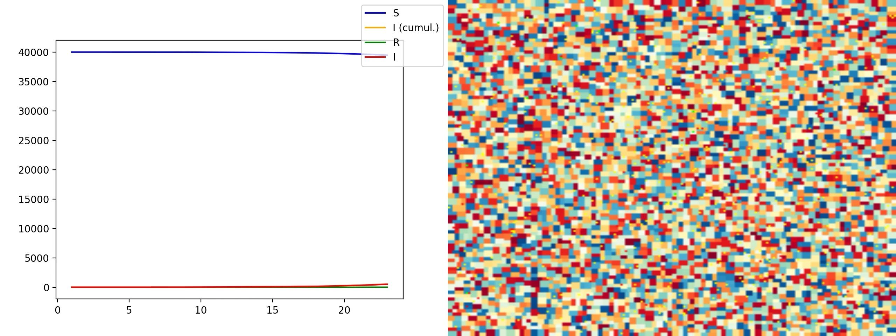
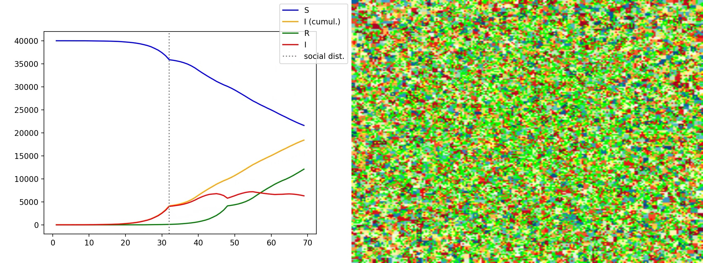
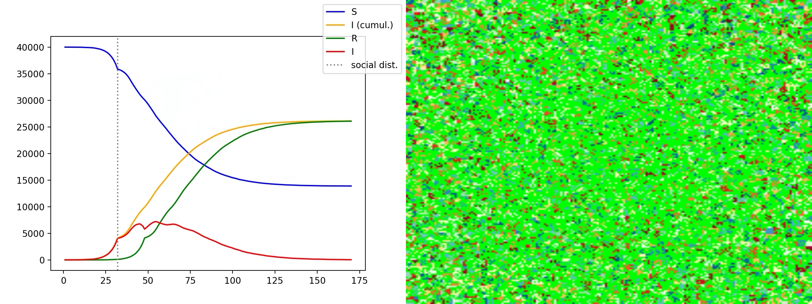

Simulation of infectious disease outbreaks for learning and probably
neither useful nor particularly interesting. Loosely based on the course 
"The Mathematics and Statistics of Infectious Disease Outbreaks" (MT3002)
at Stockholm University, Summer 2020.

The underlying idea is to simulate epidemics on an individual level with
modelling of overlapping contact groups where a group can be seen as family,
a certain age group, a work place, a neighborhood, a city, etc. Here, a BSP
tree is used for simplicity partitioning an image into smaller and smaller
partitions, where the root node represents the entire population and the
leaves the smallest groupings of the population.

An individual (represented by a pixel) has probability 1 of having contact
with anyone in their leaf. This probability falls the further away another
individual is (but the intention is to use the levels of the BSP tree to model
contact networks in the future).

  <figure style="display: flex; flex-flow: column;">
    
    <figcaption style="font-size: small">
      The contact network of a specific individual. Each colored square is a leaf,
      i.e. the most fine-grained grouping of the population. Since these are
      generated using a BSP tree, each grouping on level N is paired with a neighbor
      grouping on the same level and contained in a larger group on level N-1, etc.
      Finally, all groups are contained in the root node of the tree (level 0).
    </figcaption>
  </figure>

The contact network of an initially infected individual, shown above, is, for larger
graphs like here, obviously too large, at least for modelling daily interaction.
Aggregated on a longer scale however, this might be more realistic, e.g.
going to a café, sitting next to someone travelling on the train, attending
a conference, etc. This is work-in-progress and the probability of having contact
with someone is essentially modeled using an exponential distribution with the
distance as parameter.

## Video examples (click to play!)

## Image examples

  <figure>
    
    <figcaption>Outbreak in its initial phase with few infected.</figcaption>
  </figure>

  <figure>
    
    <figcaption>After physical distancing is recommended.</figcaption>
  </figure>

  <figure>
    
    <figcaption>Outbreak ends.</figcaption>
  </figure>

